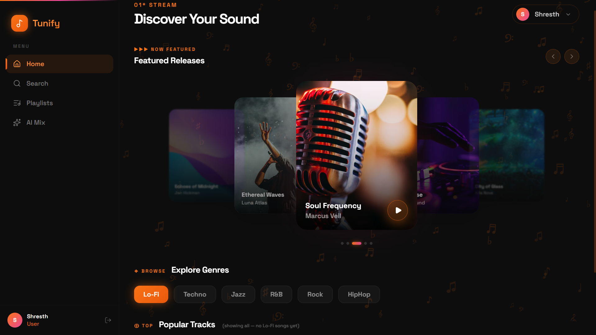
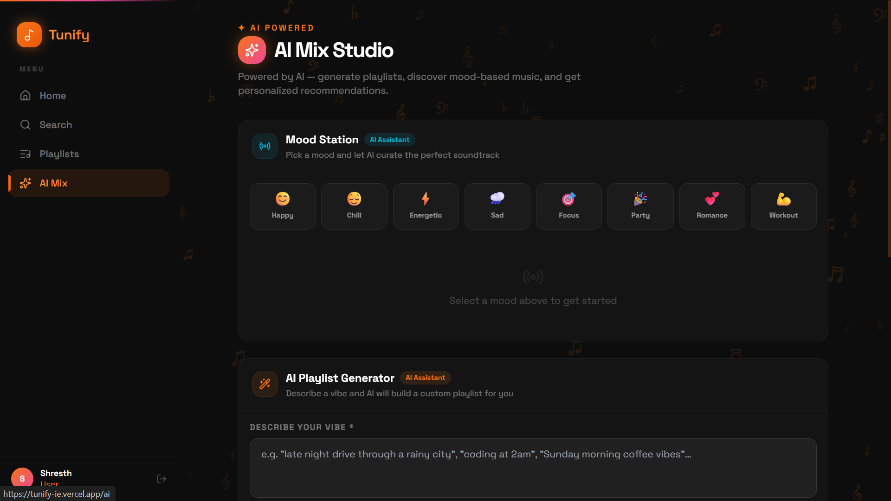

# 🎵 Tunify - AI Powered Music Streaming Platform

An AI-powered full-stack music streaming platform built using the MERN Stack that combines traditional music streaming with Generative AI to create personalized playlists and intelligent music recommendations.

---

# 🚀 Live Demo

🔗 **Live Website:** https://tunify-ie.vercel.app/

---

# 📌 Hero Screenshot

<p align="center">

</p>

---

# 📖 Problem Statement

Traditional music streaming platforms offer limited personalization beyond simple recommendation algorithms.

Tunify solves this problem by integrating Artificial Intelligence with music streaming, allowing users to:

- Generate playlists using AI
- Receive mood-based recommendations
- Discover music based on listening habits
- Enjoy a modern streaming experience with beautiful UI

---

# 🛠 Tech Stack

## Frontend

- React.js
- JavaScript
- Tailwind CSS
- Framer Motion
- React Context API
- Axios

## Backend

- Node.js
- Express.js
- MongoDB Atlas
- JWT Authentication
- bcrypt.js

## AI

- Google Gemini API

## Cloud

- Cloudinary
- AWS
- Vercel

---

# ✨ Features

### 🎧 Music Streaming

- Browse songs
- Music Player
- Featured Albums
- Genre Based Music

---

### 🤖 AI Playlist Generator

Generate complete playlists by describing a vibe.

Example:

> "Late night coding"

↓

AI generates an entire playlist.

---

### 😊 Mood Based Recommendation

Generate playlists based on emotions

- Happy
- Chill
- Workout
- Party
- Focus
- Romance
- Sad
- Energetic

---

### 🧠 Personalized Recommendation Engine

AI recommends songs based on

- Listening history
- User interests
- Recently played songs

---

### 📂 Playlist Management

- Create Playlist
- Edit Playlist
- Delete Playlist
- Favorite Songs

---

### 🔒 Authentication

- JWT Login
- Secure Signup
- Password Encryption
- Protected Routes

---

### ☁ Cloud Storage

- Cloudinary Integration
- Optimized Image Uploads

---

### 📱 Responsive UI

Fully responsive across

- Desktop
- Tablet
- Mobile

---

# 🏗 Architecture Diagram

```
                 React + Tailwind CSS
                         │
               React Context API
                         │
                    Express.js
                         │
       ┌──────────────┬──────────────┐
       │              │              │
   MongoDB        Gemini AI      Cloudinary
       │              │              │
       └──────────────┴──────────────┘
```

---

# 🎼 Dashboard Screenshot

<p align="center">

</p>

---

# 🤖 AI Mix Studio

Users can select their mood and generate AI-powered music recommendations instantly.

<p align="center">

</p>

---

# 🎵 AI Playlist Generator

Describe your vibe and let Gemini AI generate a personalized playlist.

<p align="center">

</p>

---

# 🧠 Personalized Recommendations

Receive intelligent recommendations based on listening history.

<p align="center">

</p>

---

# ⚙ Installation

Clone the repository

```bash
git clone https://github.com/Shresth2929/Tunify.git
```

Move inside the project

```bash
cd Tunify
```

Install Frontend

```bash
cd client
npm install
```

Install Backend

```bash
cd ../server
npm install
```

Start Backend

```bash
npm run dev
```

Start Frontend

```bash
cd ../client
npm run dev
```

---

# 📂 Project Structure

```
Tunify
│
├── client
│   ├── components
│   ├── pages
│   ├── context
│   ├── hooks
│   ├── assets
│   └── services
│
├── server
│   ├── controllers
│   ├── routes
│   ├── middleware
│   ├── models
│   └── config
│
└── README.md
```

---

# 🎯 Future Improvements

- Voice Controlled Music Search
- AI DJ Mode
- Spotify Integration
- Collaborative Playlists
- Smart Music Analytics
- Offline Listening
- Lyrics Generation
- Social Music Sharing

---

# 👨‍💻 Developer

**Shresth Veer Singh**

B.Tech Computer Science Engineering

Lovely Professional University

GitHub:
https://github.com/Shresth2929

---

⭐ If you like this project, consider giving it a Star.
